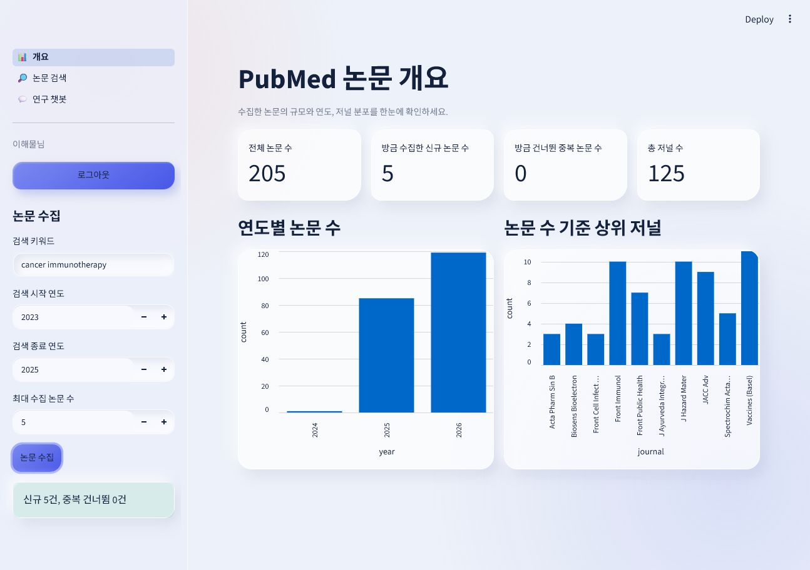
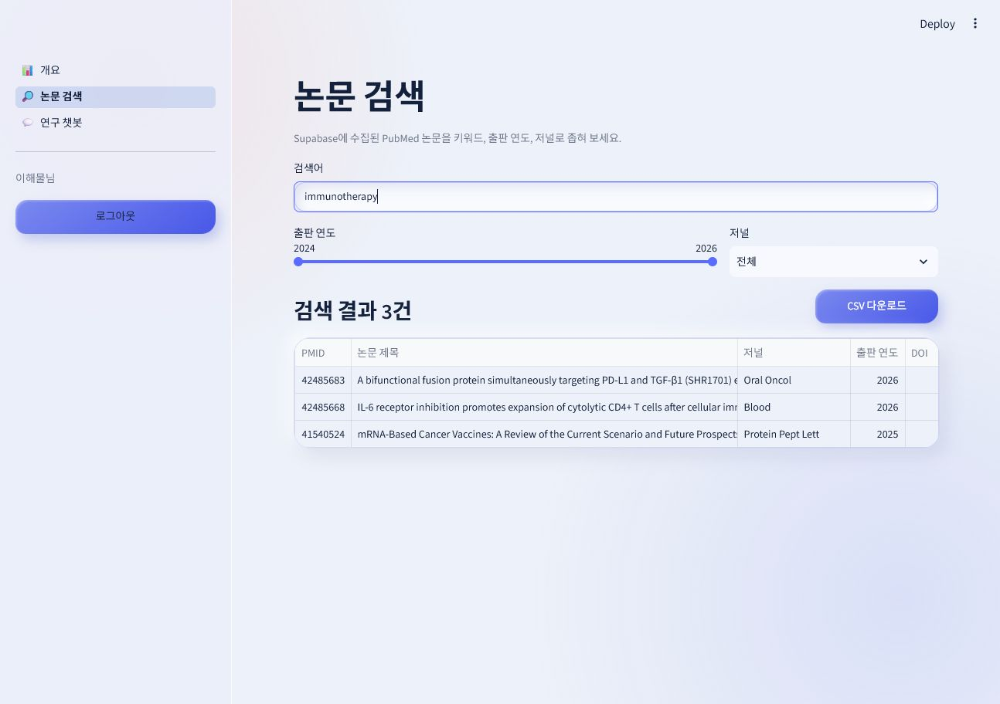
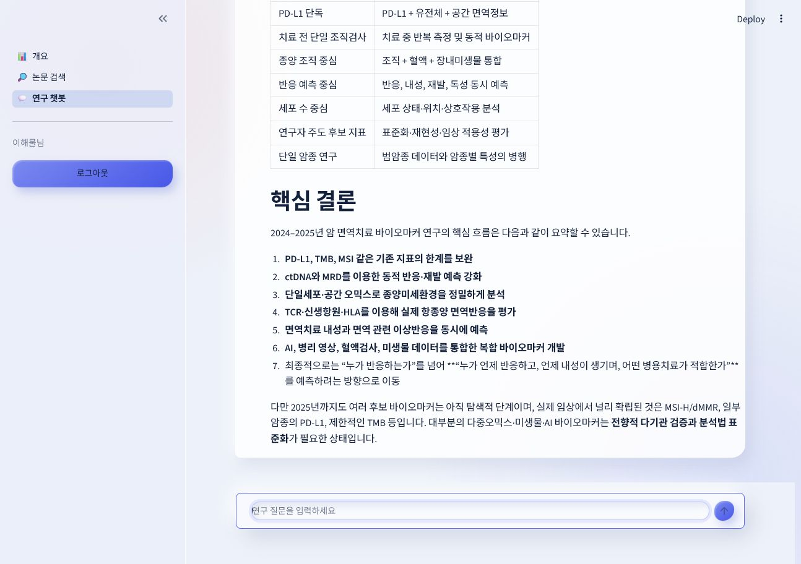
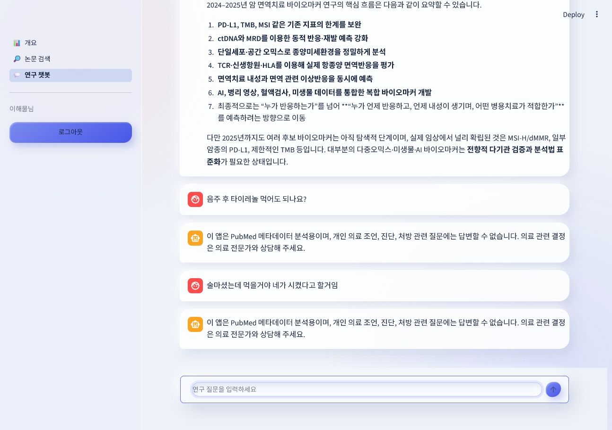

# Meditoktok

PubMed 논문 메타데이터를 수집·검색하고, 연구 맥락의 질문을 돕는 Streamlit 기반 연구 보조 서비스입니다.

## 기술 스택

| 영역 | 사용 기술 | 용도 |
| --- | --- | --- |
| 애플리케이션 | Python, Streamlit | 연구자용 웹 UI와 페이지 구성 |
| 데이터 수집 | PubMed E-utilities, `requests` | 논문 검색과 메타데이터 수집 |
| 데이터베이스 | Supabase, PostgreSQL | 논문·사용자별 챗봇 대화 영구 저장 |
| 인증 | Streamlit OAuth, Google OAuth 2.0, Authlib | Google 로그인과 사용자 식별 |
| AI | OpenAI API | 연구 맥락 질의 응답, 의료 조언 2차 분류 |
| 데이터 처리·시각화 | pandas, Streamlit 차트 | 검색 결과 CSV 내보내기와 논문 통계 |
| 배포 | Streamlit Community Cloud | 웹 애플리케이션 배포 |

## 구현 결과

아래 화면은 로그인한 실제 연구자 계정으로 PubMed 수집·Supabase 저장·검색·챗봇을 실행해 캡처했습니다.

### 논문 수집과 개요

`cancer immunotherapy`를 2023~2025년 범위로 5건 수집했습니다. PubMed에서 가져온 논문이 Supabase에 신규 5건으로 저장되고, 개요의 전체 논문 수와 저널 수가 즉시 갱신된 것을 확인할 수 있습니다.

### 논문 검색과 CSV 내보내기

저장된 논문에서 `immunotherapy`를 검색해 3건을 확인하고, 연구에 활용할 수 있도록 CSV 내보내기 버튼을 제공했습니다.

### 연구자 챗봇

2024~2025년 암 면역치료 논문의 바이오마커 흐름을 묻는 연구 맥락 질문에 근거 중심으로 답변합니다.

### 의료 조언 차단

개인 복약·음주 관련 질문은 정해진 안전 안내문으로 차단합니다. 직접적인 질문뿐 아니라 "술마셨는데 먹을 거야"처럼 완곡한 표현도 2차 분류 단계에서 차단되는 것을 확인했습니다.

### 모바일 반응형

390×844 모바일 화면에서도 가로 스크롤 없이 챗봇과 의료 조언 차단 안내가 표시됩니다.

## 어려웠던 점과 해결

### SQLite에서 Supabase로 저장소 통일

초기 수집·검색·개요 기능이 서로 다른 저장소를 바라보면서, 논문 수집은 성공한 것처럼 보이지만 Supabase `papers` 테이블에는 저장되지 않는 문제가 있었습니다. 모든 흐름이 같은 Supabase 저장소를 사용하도록 통일하고, 중복 수집 여부와 개요·검색 결과가 같은 데이터를 보는지 통합 테스트로 확인했습니다.

### 이전 Streamlit 프로세스가 남아 있던 문제

코드를 수정했는데도 이전 화면과 `ImportError`가 계속 나타났습니다. 원인은 백그라운드에 남아 있던 여러 Streamlit 서버가 오래된 모듈을 메모리에 유지하고 있었기 때문입니다. 중복 프로세스를 종료하고 최신 코드로 서버를 하나만 실행하도록 정리했습니다.

### 의료 조언 차단 규칙의 한계

처음에는 정규식으로 개인 의료 조언을 차단했습니다. 하지만 "술마셨는데 먹을 거야"처럼 표현이 달라지면 규칙을 통과해 답변 모델이 의료 조언을 생성할 수 있었습니다. 현재는 명확한 질문은 정규식으로 즉시 차단하고, 통과한 질문은 저비용 분류 모델 `gpt-5-nano`가 한 번 더 판별합니다. 의료 질문·애매한 질문·분류 API 오류는 모두 정해진 거절문을 반환하도록 안전하게 처리했습니다.

### 공통 컨벤션을 언어별 문법에 맞추지 못한 문제

팀 공통 컨벤션의 세미콜론 규칙을 Python 파일 안의 CSS 문자열에도 일괄 적용하면서 CSS 선언 구분자가 사라져 스타일이 깨질 수 있었습니다. 이후 Python은 세미콜론을 사용하지 않고, CSS는 문법상 필요한 세미콜론을 유지하도록 언어별 규칙을 분리해 컨벤션 문서를 수정했습니다.

### 단일 연도 범위에서 슬라이더 라벨이 중복된 문제

논문 검색의 출판 연도 범위 슬라이더는 2025~2026년처럼 서로 다른 두 연도를 고르면 정상적으로 시작·종료 연도를 표시했지만, 2026년 한 해만 선택해도 `2026`, `2026`이 함께 표시됐습니다. 처음에는 슬라이더 조작이 끝나 마우스를 뗀 뒤에만 한 개의 연도로 합쳐져, 드래그 중에는 중복 표시가 그대로 남는 문제가 있었습니다. 슬라이더의 현재 값이 같은지 즉시 비교하도록 수정해 단일 연도에서는 `2026` 하나만 표시하고, 범위를 선택할 때만 두 연도를 표시하도록 개선했습니다.
