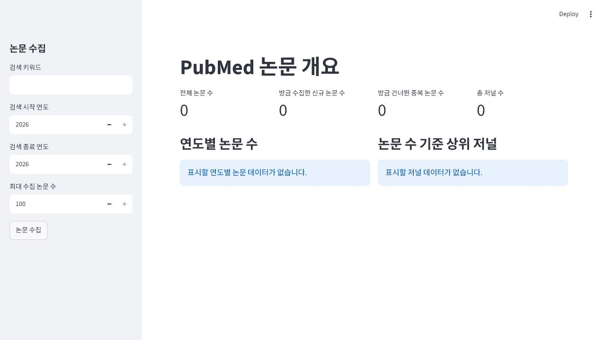

# PubMed 논문 수집 및 개요

## 구현 범위

- 사이드바에서 키워드, 검색 연도, 최대 수집 수를 검증한다.
- PubMed `esearch`와 배치 `efetch`로 논문 메타데이터를 수집한다.
- PMID를 기본 키로 사용해 `data/pubmed.db`의 `papers` 테이블에 중복 없이 저장한다.
- 개요 페이지에서 논문 수, 마지막 수집 결과, 저널 수, 연도별 논문 수, 상위 저널을 표시한다.

## 실행 방법

```powershell
py -m pip install -r requirements\collection.txt
streamlit run pages\01_overview.py
```

`NCBI_API_KEY`를 설정하면 PubMed 요청에 자동으로 포함한다. 키는 소스 코드나 Git에 저장하지 않는다.

## 검증

- 입력 검증, PubMed 응답 mock, XML 정규화, SQLite 중복 저장을 단위 테스트로 검증했다.
- 빈 데이터베이스에서도 개요 지표가 모두 0으로 표시되고 차트 영역이 오류 없이 안내 문구를 표시하는 것을 확인했다.

## 화면 캡처


